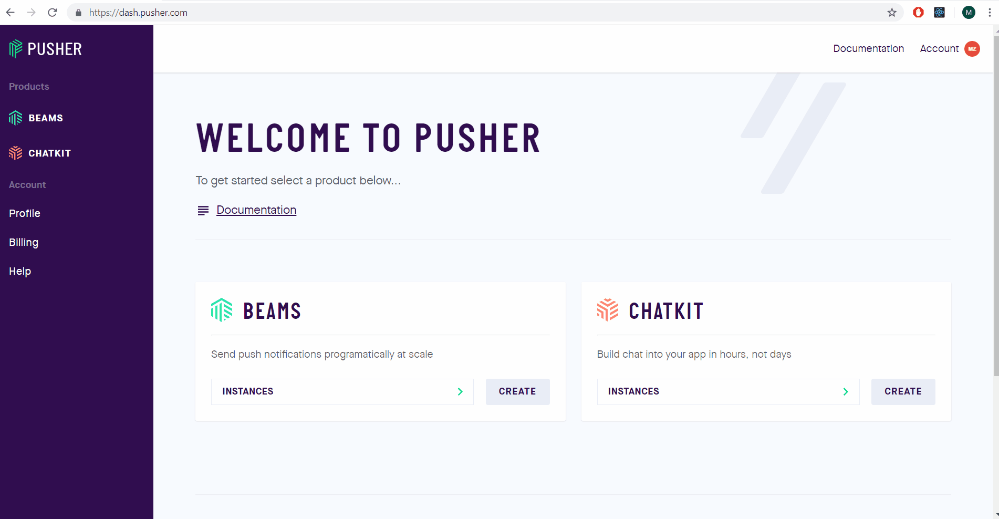

# chat-react
A chat app created with React and Chatkit. 

It consists of:
  - group chat;
  - a “Who’s online” list; and,
  - typing indicators

Chatkit is a an API that manages all our chat data for us. All we had to do is take that data and render it for the user.


## Step 1

Install
To run the program download the template:

```
git clone https://github.com/michaelzheng1/chat-react.git
cd chat-react
npm install
```

## Step 2

Then install @pusher/chatkit-server:

```
npm install --save @pusher/chatkit-server
```

Remember to replace "YOUR INSTANCE LOCATOR" and "YOUR KEY" with your own respective values for:
- ./server.js
- ./ChatScreen.js



## Step 3

To create your own Chatkit instance, head to the [dashboard](https://dash.pusher.com/?utm_source=github&utm_campaign=build-a-slack-clone-with-react-and-pusher-chatkit)
 and hit Create new:


You can create rooms programmatically (on the server or client using createRoom), or in the dashboard. This would help with testing if the 
program can send messages.


In the dashboard, head to the Console tab, where you'll find the Inspector and create a user with any name. I will call mine "Admin".
Then, create a room called "General":


## Step 4

Run the program.

```
npm start
```